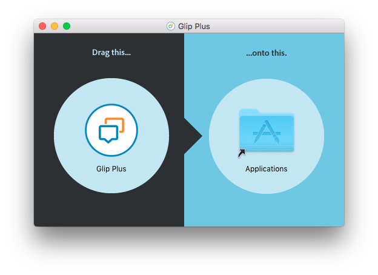
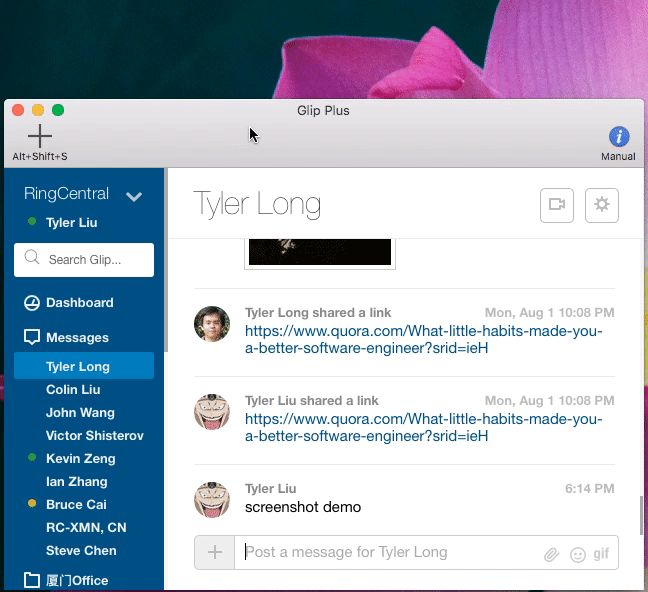
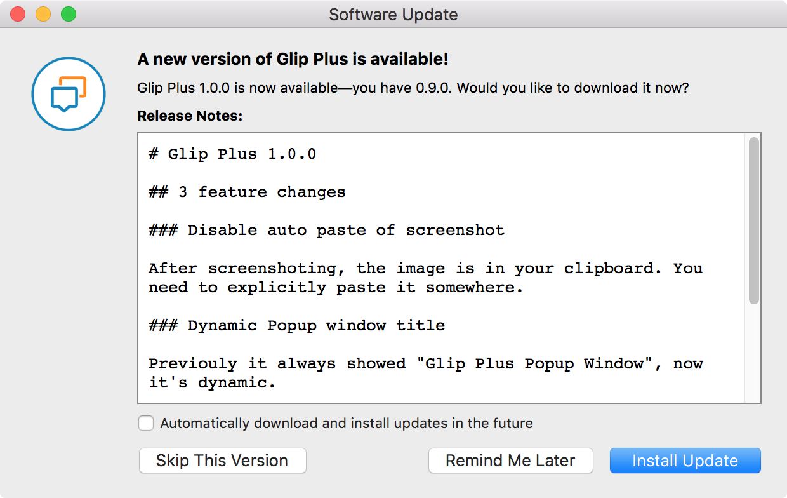

# Glip Plus

Glip Plus provides extra features to [Glip](https://glip.com).

## Install

### :point_right: [download](https://tylerlong.github.io/glip-plus-dist/releases/Glip-Plus-0.3.0.dmg) :point_left:

Then follow the instructions below:

## Screenshot feature

Press <kbd>Alt</kbd> + <kbd>Shift</kbd> + <kbd>S</kbd> to start screenshot.

Press <kbd>space</kbd> to toggle between mouse selection and window selection modes.

Press <kbd>escape</kbd> to cancel screenshot.

If the app has focus and there is a chat window, it will upload the screenshot automatically.

If the app doesn't have focus, the screenshot is saved into your pasteboard. You can paste it anywhere you would like.

## Screen recording feature

Start recording by clicking the "Screen Recording" button in the toolbar.

End recording by clicking the stop button in the menu bar.

The result file will be saved onto your desktop in `.mov` format.

## Activate hotkey

<kbd>Ctrl</kbd> + <kbd>Command</kbd> + <kbd>Alt</kbd> + <kbd>G</kbd>

This hotkey brings the app to the front of all other apps and position it to the central of your screen, even if the app is miniaturized.

## Auto upgrade

Whenever there are new versions available, the app will alert you to upgrade.

You can also choose to let it upgrade automatically in background.

## Upcoming features

- Send markdown with preview as image
- Enhancement: After screenshot, allow user to edit. (similar to QQ screenshot)
- Send video as animated gif
