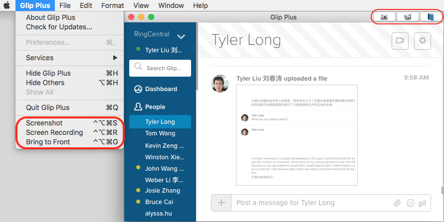
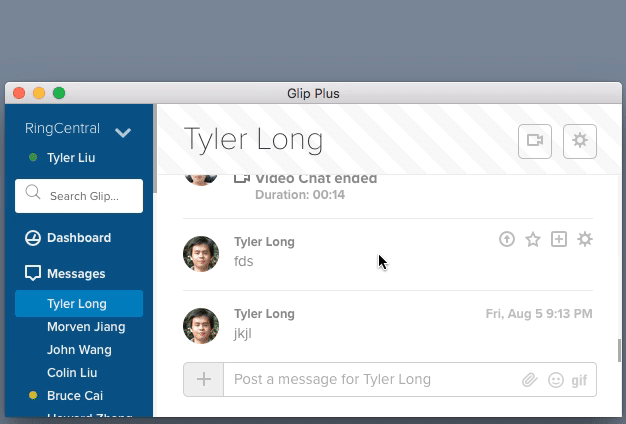

# Glip Plus

Glip Plus provides extra features to [Glip](https://glip.com).

## Install

### :point_right: [download](https://github.com/tylerlong/glip-plus-dist/tree/gh-pages/releases) :point_left:

Then follow the instructions below:

## Screenshot feature

Press <kbd>Ctrl</kbd> + <kbd>Command</kbd> + <kbd>Alt</kbd> + <kbd>S</kbd> to start screenshot.

Press <kbd>space</kbd> to toggle between mouse selection and window selection modes.

Press <kbd>escape</kbd> to cancel screenshot.

After the screenshot is taken, a preview window is shown where you can edit the screenshot.

The final screenshot is saved into your pasteboard. You can paste it anywhere you would like.

If the app is not minimized and there is a chat window, it will upload the screenshot automatically.

## Translation feature

## Screen recording feature

Start recording by pressing <kbd>Ctrl</kbd> + <kbd>Command</kbd> + <kbd>Alt</kbd> + <kbd>R</kbd>.

End recording by clicking  on the menu bar.

The result file will be saved onto your desktop in `.mov` format.

#### How does it work?

It automates QuickTime Player to record your screen.

#### Why not use QuickTime Player instead?

With Glip Plus, you can make a screen recording by simply 3 mouse clicks,
which is much more convenient than using QuickTime Player directly.

## Bring to front

<kbd>Ctrl</kbd> + <kbd>Command</kbd> + <kbd>Alt</kbd> + <kbd>G</kbd>

This hotkey brings the app to the front of all other apps and position it to the central of your screen, even if the app is minimized.

## Auto upgrade

Whenever there are new versions available, the app will alert you to upgrade.

You can also let it automatically download and install updates.

## Upcoming features

- Send markdown with preview as image
- Send video as animated gif
- Scratchpad for long text
- Desktop notifications
