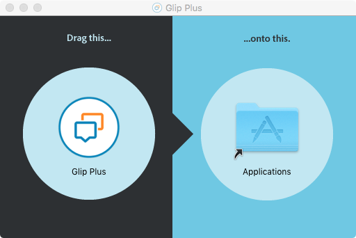

# Glip Plus

Glip Plus is [Glip](https://glip.com) with extra features.

## Install

### :point_right: [download](https://tylerlong.github.io/glip-plus-dist/releases/Glip-Plus-0.1.0.dmg) :point_left:

Then follow the instructions below:

## Screenshot feature

<kbd>Alt</kbd> + <kbd>Shift</kbd> + <kbd>S</kbd>

Please the hotkey above and drag your mouse to take a screenshot.

If the app has focus and there is a chat window, it will upload the screenshot automatically.

If the app doesn't have focus, the screenshot is saved into your pasteboard. You can paste it anywhere you would like.

During screenshot, press <kbd>space</kbd> to toggle between mouse selection and window selection modes

Press <kbd>escape</kbd> to cancel screenshot.

## Activate hotkey

<kbd>Ctrl</kbd> + <kbd>Command</kbd> + <kbd>Alt</kbd> + <kbd>G</kbd>

This hotkey can bring the app to the front of all other apps and position it to the central of your screen, even if the app is miniaturized.

## Auto upgrade

Whenever there are new versions available, the app will alert you to upgrade.

You can also choose to let it upgrade automatically in background.

## Upcoming features

- Send markdown with preview as image
- Screen recording
- Enhancement: After screenshot, allow user to edit. (similar to QQ screenshot)
